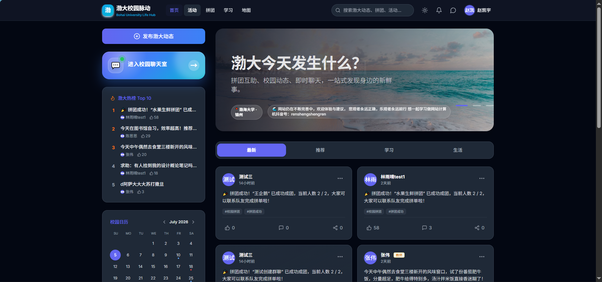
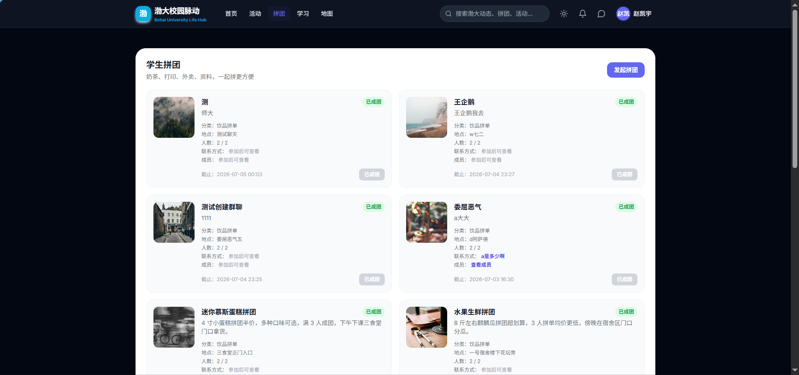
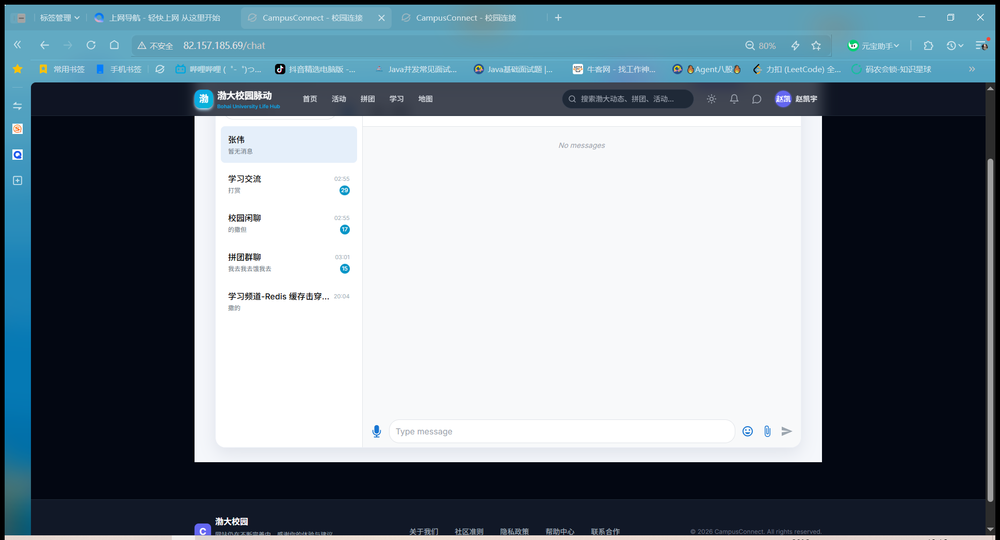
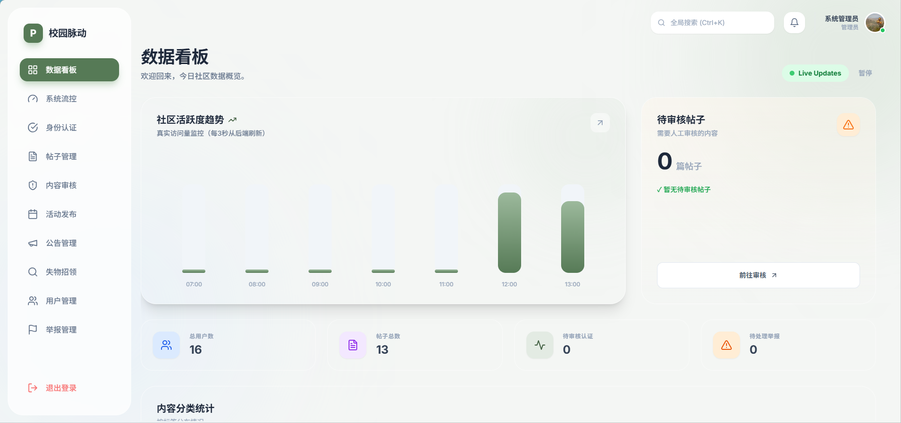
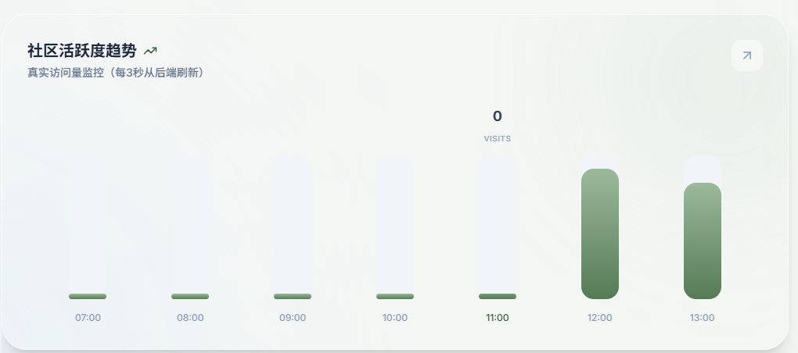
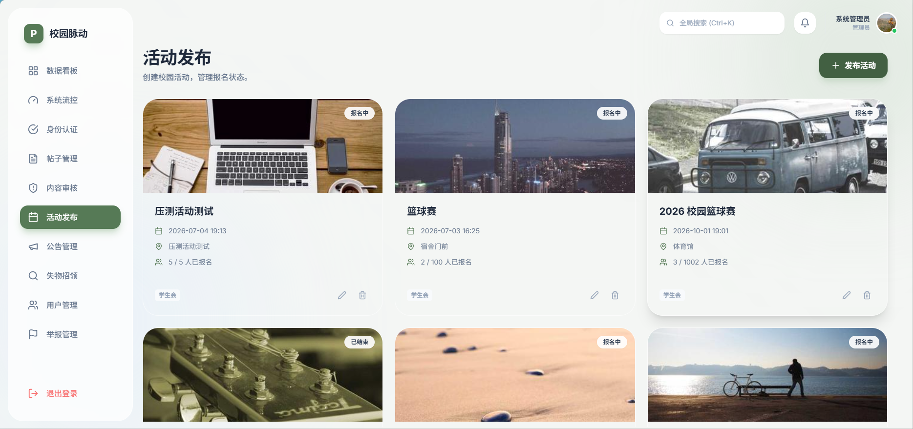

# 校园脉动 CampusConnect

一个面向高校学生的校园综合服务平台，基于 Spring Boot 3 + Vue 3 + MySQL + Redis + RabbitMQ + WebSocket 构建，覆盖校园动态、活动报名、学生拼团、实时聊天室、失物招领、后台管理等业务场景。

项目已部署至腾讯云服务器，支持公网访问、后台管理、实时消息推送和运营数据看板展示。

## 在线体验

- 前台地址：http://82.157.185.69
- 后台地址：http://82.157.185.69/admin

> 测试账号可在面试或演示时提供。

## 技术栈

### 后端

- Spring Boot 3.5
- Spring Security + JWT
- MyBatis-Plus
- MySQL 8
- Redis / Redisson
- RabbitMQ
- WebSocket
- CompletableFuture
- Docker

### 前端

- Vue 3
- Vite
- Pinia
- Vue Router
- Tailwind CSS
- Axios

### 部署

- 腾讯云轻量服务器
- Docker
- Nginx
- MySQL / Redis / RabbitMQ 容器化部署

## 项目亮点

### 1. 活动报名并发控制

针对校园活动限量报名场景，设计 Redis Lua + Redisson + MySQL 条件更新的并发控制方案，避免高并发下出现超卖和重复报名。

- 使用 Redis Lua 脚本原子完成库存判断、重复报名判断、库存预扣减和用户报名标记写入。
- 使用 Redisson 对同一用户同一活动维度加锁，避免重复点击、网络重试或多实例部署下的并发写入冲突。
- MySQL 层通过 `participant_count < max_participants` 条件更新防止超卖，并通过 `activity_id + user_id` 唯一索引限制重复报名。
- 设计 Redis 与 MySQL 补偿逻辑，MySQL 落库失败时回滚 Redis 库存和报名标记。
- 使用 JMeter 模拟多用户并发报名，验证限量活动场景下不会出现超卖和重复报名。

### 2. 首页热门动态缓存击穿优化

针对首页热门动态 Top10 高频访问场景，引入 Redis 缓存和互斥锁机制，降低热点 Key 失效瞬间的数据库压力。

- 热门动态优先从 Redis 读取，减少 MySQL 高频查询。
- 缓存未命中时使用 Redis 互斥锁控制回源，避免大量请求同时击穿到数据库。
- 获取锁后进行二次缓存检查，防止重复查询 MySQL。
- 查询 MySQL 后回写 Redis，并设置合理过期时间。
- 使用 Lua 脚本安全释放锁，避免误删其他线程的锁。

### 3. 学生拼团异步事件驱动

围绕学生拼团场景，使用 RabbitMQ 实现成团、取消、过期等状态事件的异步解耦。

- 拼团成功后发布事件，异步联动通知、动态、统计等模块。
- 基于 RabbitMQ TTL + DLX 实现拼团过期延迟检查，到期后自动校验数据库状态并流转为 EXPIRED。
- 使用 CompletableFuture 和自定义线程池并行聚合拼团列表、用户参与状态、发起状态和统计数据，减少首页接口等待时间。
- 通过 WebSocket 向前端推送拼团状态变化，右下角实时卡片展示拼团动态。

### 4. 实时聊天室与已读统计

实现校园聊天室模块，支持私聊、群聊、消息持久化、未读数和已读状态。

- 基于 WebSocket 实现聊天消息实时推送，维护用户与连接会话映射关系，支持同一用户多窗口在线。
- 使用 MySQL 持久化会话、成员、消息和已读记录。
- 使用 Redis Bitmap 实现消息已读人数统计，以 messageId 为 Key、userId 为 offset，通过 SETBIT 标记已读、BITCOUNT 统计已读人数。
- 支持查询消息已读用户列表和已读时间，实现“谁已读”功能。
- 实现阅后即焚消息，接收方查看后自动更新焚毁状态，再次查询时隐藏原始内容。

### 5. 后台运营数据看板

实现后台管理数据看板，展示用户数、帖子数、待审核认证、待处理举报和访问量趋势等核心指标。

- 基于 MySQL 聚合用户、帖子、认证、举报等业务数据。
- 自定义 VisitMetricsFilter 实现接口级 PV 统计，在请求入口统一埋点。
- 使用 Redis 按小时分桶记录访问量，基于 INCR 原子自增降低高频统计对 MySQL 的写入压力。
- 后台趋势接口读取最近 7 小时访问量数据，返回时间序列供前端图表渲染。
- 排除 OPTIONS、WebSocket、后台看板自身请求等无效请求，避免统计数据虚高。


## 项目截图

### 首页动态



### 学生拼团



### 实时聊天室



### 后台数据看板



### 系统流控



### 活动管理




## 数据库初始化

项目数据库使用 MySQL 8，初始化表结构文件位于：

```text
docs/sql/campusconnect_schema.sql

mysql -uroot -p < docs/sql/campusconnect_schema.sql
初始化方式：

mysql -uroot -p < docs/sql/campusconnect_schema.sql

本仓库仅提供数据库表结构 SQL，不包含真实用户数据、密码、帖子内容等敏感信息。


注意：我们放的是 `campusconnect_schema.sql`，不是完整的 `campusconnect.sql`。

---


