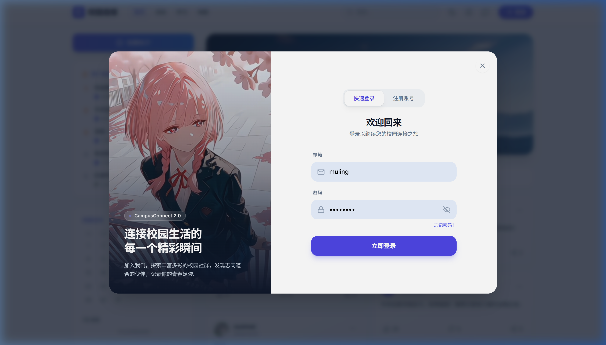
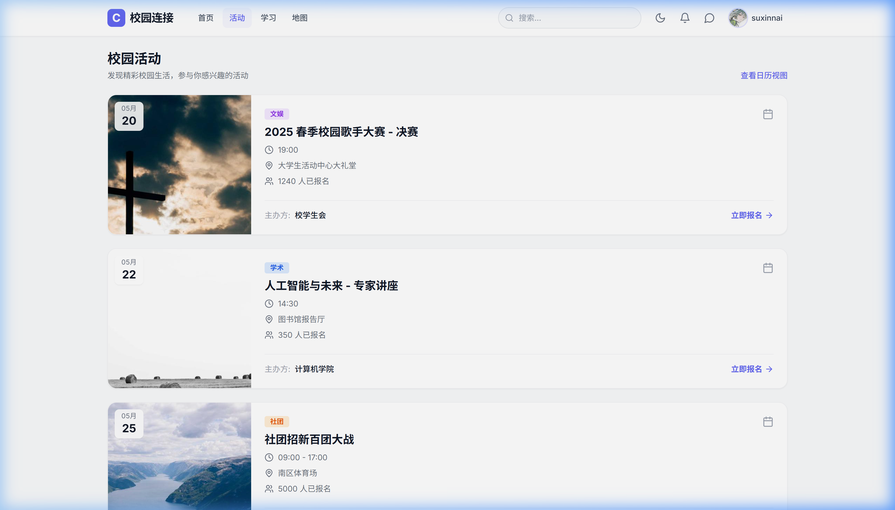
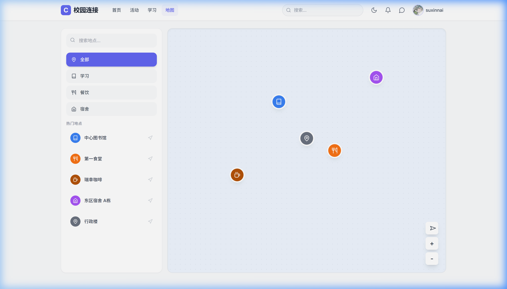

# 校园脉动 (CampusConnect) — 校园综合服务平台

## 📖 项目简介

**校园脉动 (CampusConnect)** 是一款面向高校师生的一站式校园综合服务与社交平台。项目采用前后端分离架构，前端基于 Vue 3 + Vite，后端基于 Spring Boot 3 + MyBatis-Plus，覆盖了从校园社交、活动报名、失物招领到后台智能审核等丰富的业务场景。

> 本项目为毕业设计作品，完整展示了一个现代化 Web 平台从需求分析、数据库设计到前后端开发及部署的全流程。

---

## 🔗 访问入口

本地启动成功后，可通过以下地址访问对应模块：

| 模块 | 地址 |
|---|---|
| 前台用户端 | [http://localhost:3000/](http://localhost:3000/) |
| 后台管理端 | [http://localhost:3000/admin](http://localhost:3000/admin) |

---

## 📸 系统截图展示

### 1. 用户登录与注册
支持邮箱/学号登录，包含密码强度校验与弱口令拦截。


### 2. 社区动态首页
浏览校园新鲜事，支持发帖（含图片附件）、评论、点赞、收藏、分享，以及匿名发布。右侧侧边栏展示热门动态 Top10、校园日历、公告与失物招领信息。


### 3. 校园活动
一站式查看讲座、社团招新、体育比赛等活动，支持在线报名/取消报名，查看已报名活动列表。


### 4. 校园地图
可视化校园地标导航，帮助新生与访客快速定位教学楼、食堂、图书馆等重要设施，支持搜索与地点详情查看。


### 5. 后台管理系统
管理员专属后台，含可视化数据大屏、用户管理、内容审核、举报处理、公告管理、身份认证审核等完整管理功能。


---

## 🎨 功能模块详解

### 前台用户端

| 模块 | 功能说明 |
|---|---|
| **🔐 注册与登录** | 支持邮箱注册、邮箱/用户名登录；JWT双Token机制（AccessToken + RefreshToken）实现无状态认证；密码使用强度规则校验与弱口令检测 |
| **👤 个人中心** | 完善的个人资料编辑（头像、封面、昵称、签名、学院、专业、班级、宿舍等）；关注/粉丝社交关系链；隐私设置管理；查看个人发帖记录 |
| **🛡️ 身份认证** | 支持三种角色认证 — **学生认证**、**教师认证**、**机构/部门入驻**；需上传证件照片经管理员人工审核通过后获得专属认证标识 |
| **� 校园社区 (动态/论坛)** | 支持富文本帖子发布（含多图上传、标签分类）、匿名发布、编辑与删除；帖子列表/热门推荐/搜索筛选；评论与嵌套回复、评论点赞；帖子点赞、收藏、分享及浏览量统计 |
| **💬 私信与群聊** | 一对一私聊会话与群聊创建；消息历史记录与分页查看；未读消息计数与标记已读；会话删除管理 |
| **🔔 通知系统** | 评论通知、回复通知、关注通知等多类型；未读计数红点提示；单条已读/全部已读/清空操作 |
| **📅 校园活动** | 活动列表展示（含分页与状态筛选）；一键报名与取消报名；我的已报名活动列表；活动详情查看（含人数上限判断） |
| **🗺️ 校园地图** | 互动式校园地标展示与搜索导航；地点详情信息查看 |
| **📚 学习互助与资源分享** | 自习室实时状态概览（空闲/有课/拥挤）；学习资料库（PDF/DOCX/XLSX 等文件）搜索与下载；精品网课推荐；学习小组入口 |
| **📋 失物招领** | 丢失/拾到信息发布与查看；状态管理（进行中/已解决） |
| **📢 系统公告** | 校级公告信息展示；校园日历（含课程/节假日标注） |
| **� 意见反馈** | 用户可提交平台建议、Bug反馈等 |

### 后台管理端 (Admin)

| 模块 | 功能说明 |
|---|---|
| **📊 数据大屏** | 可视化仪表盘展示平台运营核心指标（用户数、帖子数、评论数等）；活动趋势折线图；内容分类统计 |
| **👥 用户管理** | 用户列表查看与分页搜索；修改用户信息与角色（USER / MODERATOR / ADMIN）；封禁/解封用户状态管理 |
| **📝 帖子管理** | 全量帖子列表管控；帖子置顶/取消置顶；帖子删除 |
| **🔍 内容审核** | 待审核帖子队列（PENDING 状态）；逐条审核通过/拒绝操作；**AI 辅助智能审核**（集成 SiliconFlow 大模型 API，自动识别辱骂、广告、违规等内容并给出审核建议与置信度评分） |
| **🛡️ 身份认证审核** | 查看学生/教师/机构的认证申请列表；审核通过或拒绝（附拒绝原因） |
| **⚠️ 举报管理** | 查看帖子/评论/用户举报工单；处理动作：删除内容、封禁账号或警告；标记已处理/已忽略 |
| **📢 公告管理** | 发布/编辑/删除系统公告；置顶/取消置顶 |
| **📅 活动管理** | 创建/编辑/删除校园活动；活动状态全生命周期管理 |
| **🔍 失物招领管理** | 管理所有失物招领信息的编辑/删除/置顶 |

---

## 🛠️ 技术栈

### 后端 (`campusconnect-api`)

| 技术 | 说明 |
|---|---|
| Java 21 | 主要编程语言 |
| Spring Boot 3.5.x | 核心应用框架 |
| Spring Security | 安全认证与权限控制 |
| JWT (jjwt 0.12) | 无状态登录认证（双Token：Access + Refresh） |
| MyBatis-Plus 3.5.5 | ORM 持久层框架（含逻辑删除、自动填充、分页插件） |
| MySQL 8.x | 关系型数据库 |
| Lombok | 简化 POJO 模板代码 |
| Hutool 5.8 | Java 工具类库 |
| Commons-IO | 文件上传处理 |
| Maven | 项目构建与依赖管理 |

### 前端 (`campusconnect-web`)

| 技术 | 说明 |
|---|---|
| Vue 3.4.x | 核心 UI 框架（Composition API + `<script setup>` 语法） |
| Vite 6.x | 极速开发构建工具 |
| Vue Router 4 | 前端路由管理（含路由懒加载） |
| Pinia 2 | 状态管理（替代 Vuex） |
| Axios | HTTP 请求库（含拦截器、Token 自动刷新） |
| Tailwind CSS 3 | 原子化 CSS 样式方案 |
| Lucide Icons | 精美矢量图标库 |
| SiliconFlow AI API | AI 内容安全审核（GLM-4 大模型） |
| QRCode | 二维码生成 |

---

## 📂 项目结构

```text
campus/
├── campusconnect-api/                  # 后端 Spring Boot 项目
│   ├── src/main/java/com/campusconnect/
│   │   ├── controller/                 # API 控制器层
│   │   │   ├── AuthController.java     #   登录/注册/Token刷新/登出
│   │   │   ├── UserController.java     #   个人中心/关注/身份认证申请
│   │   │   ├── PostController.java     #   帖子 CRUD/点赞/搜索/推荐
│   │   │   ├── CommentController.java  #   评论/回复/点赞
│   │   │   ├── MessageController.java  #   私信/群聊/会话管理
│   │   │   ├── NotificationController  #   通知管理
│   │   │   ├── EventController.java    #   活动报名/取消/我的活动
│   │   │   ├── FileController.java     #   文件/图片上传
│   │   │   ├── AdminController.java    #   后台管理全部接口
│   │   │   └── SystemController.java   #   系统配置/公告/失物招领/反馈
│   │   ├── entity/                     # 数据库实体类
│   │   │   ├── User.java               #   用户（含角色/认证状态/校园信息）
│   │   │   ├── Post.java               #   帖子（含AI审核字段）
│   │   │   ├── Comment.java            #   评论（嵌套回复）
│   │   │   ├── Conversation.java       #   聊天会话
│   │   │   ├── Message.java            #   聊天消息
│   │   │   ├── Notification.java       #   通知
│   │   │   ├── Activity.java           #   校园活动
│   │   │   ├── Verification.java       #   身份认证申请
│   │   │   ├── Report.java             #   举报记录
│   │   │   ├── LostFound.java          #   失物招领
│   │   │   └── Announcement.java       #   系统公告
│   │   ├── service/                    # 业务逻辑层
│   │   ├── mapper/                     # MyBatis-Plus Mapper 接口
│   │   ├── dto/                        # 数据传输对象
│   │   ├── security/                   # JWT 鉴权与 Spring Security 配置
│   │   ├── config/                     # 全局配置（CORS/分页/数据迁移等）
│   │   └── common/                     # 统一返回类 Result / PageResult
│   ├── src/main/resources/
│   │   ├── application.yml             # 主配置文件
│   │   └── db/schema.sql               # 完整数据库建表 SQL 脚本
│   └── pom.xml                         # Maven 依赖配置
│
└── campusconnect-web/                  # 前端 Vue 3 项目
    ├── src/
    │   ├── views/                      # 页面级视图
    │   │   ├── HomeView.vue            #   社区首页
    │   │   ├── EventsView.vue          #   校园活动页
    │   │   ├── StudyView.vue           #   学习互助页（自习室/资料库/网课/学习小组）
    │   │   ├── MapView.vue             #   校园地图页
    │   │   └── admin/                  #   后台管理系统
    │   │       ├── AdminView.vue       #     管理后台入口（含独立登录页）
    │   │       └── components/         #     仪表盘/用户管理/帖子管理/审核/举报/公告/活动/认证/失物招领
    │   ├── components/                 # 公共组件
    │   │   ├── Navbar.vue              #   顶部导航栏
    │   │   ├── Sidebar.vue             #   侧边栏（热门/日历/公告/失物招领）
    │   │   ├── Feed.vue                #   动态信息流
    │   │   ├── Hero.vue                #   首页 Hero 区域
    │   │   └── modals/                 #   弹窗模态框
    │   │       ├── LoginModal.vue      #     登录/注册弹窗
    │   │       ├── ProfileModal.vue    #     个人中心/编辑资料/身份认证
    │   │       ├── CreatePostModal.vue #     发帖弹窗
    │   │       ├── PostDetailModal.vue #     帖子详情/评论
    │   │       ├── MessagesModal.vue   #     私信/群聊面板
    │   │       └── NotificationsModal  #     通知列表
    │   ├── api/                        # API 接口层（Axios 封装）
    │   ├── stores/                     # Pinia 状态管理
    │   ├── composables/                # Vue 组合式函数（验证码/表单校验/密码强度）
    │   ├── utils/                      # 工具函数
    │   └── router/                     # Vue Router 路由配置
    ├── vite.config.js                  # Vite 配置（含 API 代理）
    └── package.json
```

---

## 🚀 快速启动

### 1. 环境要求

| 工具 | 版本 |
|---|---|
| JDK | ≥ 21 |
| Node.js | ≥ 18（推荐 20 LTS） |
| MySQL | ≥ 8.0 |
| Maven | ≥ 3.6 |

### 2. 数据库初始化

```sql
CREATE DATABASE campusconnect DEFAULT CHARACTER SET utf8mb4 COLLATE utf8mb4_unicode_ci;
```

然后执行项目内的初始化脚本：

```bash
mysql -u root -p campusconnect < campusconnect-api/src/main/resources/db/schema.sql
```

### 3. 配置后端

编辑 `campusconnect-api/src/main/resources/application.yml`，修改数据库连接信息：

```yaml
spring:
  datasource:
    url: jdbc:mysql://localhost:3306/campusconnect?useUnicode=true&characterEncoding=utf-8&serverTimezone=Asia/Shanghai&useSSL=false&allowPublicKeyRetrieval=true
    username: <你的数据库用户名>
    password: <你的数据库密码>
```

### 4. 启动后端

```bash
cd campusconnect-api
mvn clean install
mvn spring-boot:run
```

> 后端默认运行在 `http://localhost:8080`，API 基础路径为 `/api`

### 5. 启动前端

```bash
cd campusconnect-web
npm install
npm run dev
```

> 前端默认运行在 `http://localhost:3000`，已配置 Vite 代理自动转发 `/api` 请求至后端

---

## ⚙️ 核心技术亮点

- **JWT 双 Token 机制**：AccessToken (24h) + RefreshToken (7天)，实现无感刷新，提升用户体验
- **AI 智能审核**：集成 SiliconFlow GLM-4 大模型 API，自动检测辱骂、广告、作弊等违规内容，输出审核结论与置信度评分，并提供 AI 辅助审核建议
- **Keyword Fallback**：AI 不可用时自动降级为本地关键词检测，保障审核不中断
- **三级身份认证**：学生 / 教师 / 机构三种认证类型，上传证件照片后由管理员人工审核
- **统一响应封装**：后端 `Result<T>` 标准返回结构，前端 Axios 拦截器统一处理异常与 Token 刷新
- **逻辑删除**：基于 MyBatis-Plus `@TableLogic` 实现数据软删除
- **数据库自动迁移**：`MigrationRunner` 在程序启动时自动执行增量 SQL 脚本

---

## 📄 许可证

本项目为毕业设计学习用途，如需将部分代码用于商业项目，请自行确保相关依赖的开源协议授权合规。
# campusconnect-social

